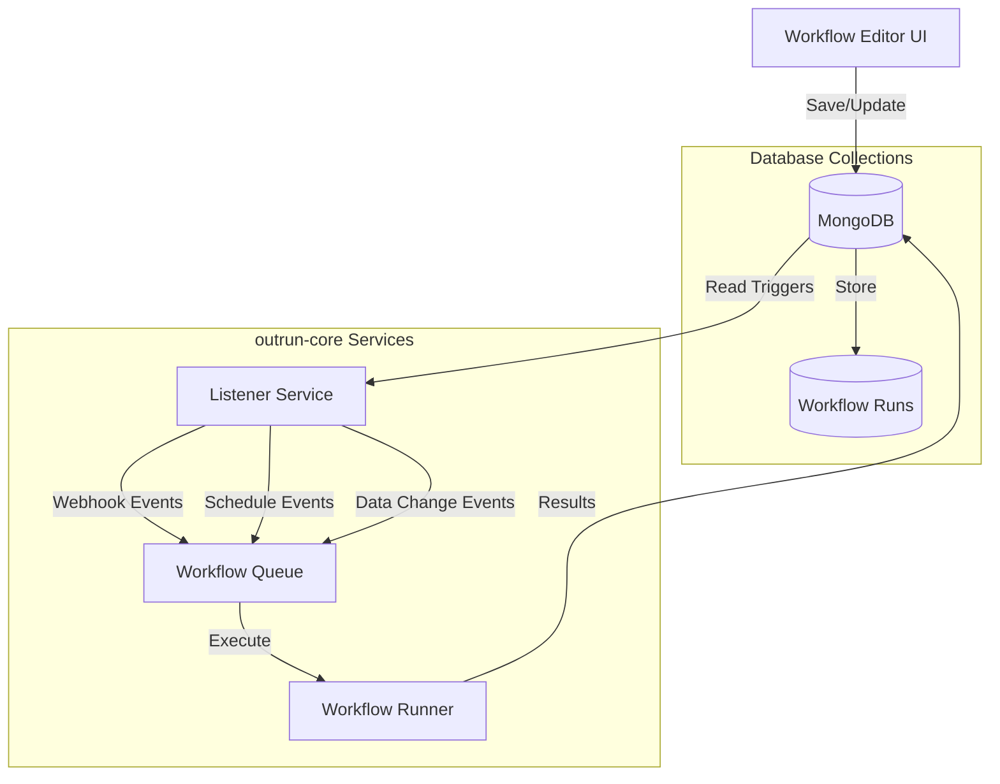

# Event-Driven Workflow Architecture Plan

## 🎯 **Vision**

Transform the workflow system from direct frontend execution to a robust, event-driven architecture with database persistence and automatic triggering.

## 🏗️ **New Architecture**



## 📊 **Database Schema**

### **workspace_{workspaceId}_workflows**
```javascript
{
  id: "workflow-123",
  workspaceId: "ws-456", 
  name: "Lead Processing Pipeline",
  status: "active", // draft, active, paused, archived
  nodes: [...], // ReactFlow nodes
  edges: [...], // ReactFlow edges
  triggers: [
    {
      id: "trigger-1",
      type: "webhook", // webhook, schedule, data_change, manual
      config: { webhookUrl: "/webhook/ws-456/trigger-1" },
      active: true
    }
  ],
  settings: {
    timeout: 300000,
    retryPolicy: { maxRetries: 3, backoffStrategy: "exponential" },
    concurrency: 1
  },
  stats: {
    totalRuns: 156,
    successfulRuns: 142,
    failedRuns: 14,
    avgExecutionTime: 2500
  }
}
```

### **workflow_{workspaceId}_runs**
```javascript
{
  id: "run-789",
  workflowId: "workflow-123",
  status: "completed", // queued, running, completed, failed, cancelled
  triggeredBy: {
    type: "webhook",
    source: "/webhook/ws-456/trigger-1", 
    payload: { leadId: "lead-999" }
  },
  steps: [
    {
      nodeId: "node-1",
      nodeType: "ai-agent",
      status: "completed",
      duration: 1200,
      input: { text: "John Doe from Acme Corp" },
      output: { classification: "hot_lead", confidence: 0.92 }
    }
  ],
  usage: {
    aiTokensUsed: 150,
    estimatedCost: 0.003,
    webhooksCalled: 2
  }
}
```

## 🔄 **Service Responsibilities**

### **1. Frontend (outrun-app)**
- ✅ **Visual Workflow Editor** - Drag/drop nodes, edit properties
- ✅ **Database Sync** - Save workflows to MongoDB
- ✅ **Trigger Management** - Configure webhooks, schedules, conditions  
- ✅ **Run History** - View execution logs and analytics
- ❌ **NO Direct Execution** - Only reads/writes database

### **2. Listener Service (outrun-core/listener)**
- ✅ **Webhook Endpoints** - Generate unique URLs per trigger
- ✅ **Cron Scheduling** - Time-based workflow triggers
- ✅ **Data Change Monitoring** - MongoDB change streams
- ✅ **Queue Management** - Enqueue workflows for execution
- ✅ **Trigger Statistics** - Track trigger usage

### **3. Workflow Runner (outrun-core/workflows)**
- ✅ **AI Agent Execution** - OpenAI Agents SDK integration
- ✅ **Non-AI Operations** - Webhooks, parsers, transformers
- ✅ **Step Tracking** - Detailed execution logs
- ✅ **Error Handling** - Retry policies and failure recovery
- ✅ **Resource Monitoring** - Token usage and cost tracking

## 🚀 **Implementation Phases**

### **Phase 1: Database Setup ✅**
- [x] Create workflow schemas
- [x] Define run tracking structure
- [x] Setup trigger listener schema

### **Phase 2: Listener Service ✅**
- [x] TriggerManager class
- [x] WorkflowQueue system
- [x] Webhook endpoint generation
- [x] Cron job scheduling
- [x] Docker container setup

### **Phase 3: Frontend Refactor ✅**
- [x] WorkflowAPI client
- [x] Remove direct execution
- [x] Database-only operations
- [x] Run history viewing

### **Phase 4: Service Integration ✅**
- [x] Docker Compose configuration
- [x] Service dependencies
- [x] Port allocation (3005, 3006)

## 🛠️ **Next Steps**

### **Immediate (Next Sprint)**
1. **Backend API Routes** - Create Express routes for WorkflowAPI
2. **Database Migration** - Move existing workflows to new schema
3. **Frontend Integration** - Update WorkflowEditor to use WorkflowAPI
4. **Basic Testing** - Verify end-to-end workflow creation/execution

### **Short Term (1-2 Weeks)**
1. **Trigger UI** - Frontend components for configuring triggers
2. **Run Dashboard** - Real-time execution monitoring
3. **Error Handling** - Robust failure recovery and retry logic
4. **Webhook Security** - Signature validation and authentication

### **Medium Term (2-4 Weeks)**
1. **Advanced Scheduling** - Complex cron expressions, timezone support
2. **Data Change Triggers** - MongoDB change stream integration
3. **Workflow Templates** - Pre-built workflow library
4. **Performance Optimization** - Queue batching, parallel execution

### **Long Term (1-2 Months)**
1. **Multi-Tenant Security** - Workspace isolation and permissions
2. **Advanced Analytics** - Cost analysis, performance insights
3. **Workflow Versioning** - Track and rollback workflow changes
4. **Integration Marketplace** - Third-party connectors

## 📈 **Benefits**

### **For Users**
- **Reliable Automation** - Workflows run even when UI is closed
- **Real-time Triggers** - Instant response to webhooks/data changes
- **Detailed Monitoring** - Complete execution history and analytics
- **Cost Transparency** - Token usage and cost tracking per run

### **For System**
- **Horizontal Scaling** - Independent service scaling
- **Fault Tolerance** - Isolated failure handling
- **Resource Efficiency** - Queue-based execution management
- **Maintenance** - Independent service deployments

## 🔧 **Environment Variables**

```bash
# outrun-core/.env
MONGO_URI=mongodb://localhost:27017/outrun
WORKFLOW_SERVICE_URL=http://localhost:3005
LISTENER_SERVICE_URL=http://localhost:3006
OPENAI_API_KEY=your_openai_key

# outrun-app/.env.local
WORKFLOW_API_URL=http://localhost:3001  # Through API gateway
```

## 🚦 **Development Commands**

```bash
# Start all services
cd outrun-core
docker-compose up -d

# Development mode
cd outrun-core/scripts
./start-dev.sh

# Individual services
cd outrun-core/workflows && npm run dev
cd outrun-core/listener && npm run dev
```

## 📝 **Migration Strategy**

1. **Parallel Development** - Build new system alongside existing
2. **Gradual Migration** - Move workflows one workspace at a time
3. **Feature Flags** - Toggle between old/new execution
4. **Data Preservation** - Export/import existing workflow definitions
5. **User Training** - Documentation and demos for new features

This architecture provides a foundation for enterprise-grade workflow automation with reliability, scalability, and comprehensive monitoring. 